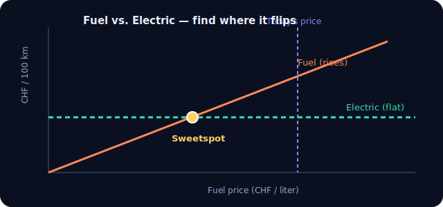

# PHEV Sweetspot Calculator

A small, beautiful web app for plug-in hybrid (PHEV) drivers: enter current fuel and
electricity prices plus your consumption, and instantly see whether you should **drive on
fuel or on electric power** — visualised as the crossing point ("sweetspot") of two cost graphs.



## What it does

- Compares fuel vs. electricity as an **equivalent price in one familiar unit** (CHF/L or
  CHF/kWh): the verdict shows your actual price next to the other option translated into the
  same unit, plus the real cost per 100 km.
- The **chart** is a 2D break-even map: fuel price on one axis (CHF/L), electricity price on
  the other (CHF/kWh). The diagonal **break-even line** is where both cost the same; below it
  charging wins, above it fuel wins. A **"you are here" dot** marks your current prices, so you
  see at a glance which side you're on.
- A chart **toggle** swaps which price is on the x-axis (fuel ↔ electricity).
- **Current fuel price** — a single global value (with quick −/+ buttons) shown at the top.
  Fuel price changes often and is the same at the pump for every scenario, so you set it
  once and it applies everywhere.
- **Scenarios** (Winter, Summer, With trailer, …) — fully editable named presets, each
  holding a consumption profile (L/100km and kWh/100km).
- **Charging locations** — a list of places, each with its own CHF/kWh price (changes rarely).
  Seeded with Home (0.31), Weekend (0.40) and Public fast charger (0.90).
- **English / German** — switch the whole UI language with the EN/DE toggle (top right).
  Your choice is remembered.
- Everything is stored in a local **SQLite** database and survives restarts. Databases
  created by older versions are migrated automatically on startup.
- **Works offline** — Chart.js, the annotation plugin and the Inter font are self-hosted
  under `app/static/vendor/` and `app/static/fonts/` (no CDN / internet needed).

## The math

```
fuel cost / 100 km     = fuel_consumption (L/100km)  × fuel_price (CHF/L)
electric cost / 100 km = power_consumption (kWh/100km) × kwh_price (CHF/kWh)
break-even fuel price  = (power_consumption × kwh_price) / fuel_consumption
break-even kWh price   = (fuel_consumption × fuel_price) / power_consumption
```

Example: `6.5 × 1.80 = CHF 11.70` (fuel) vs. `21 × 0.31 = CHF 6.51` (electric) →
electric wins; break-even fuel price ≈ `CHF 1.00 / L`. The mirror question — *at fuel
CHF 1.80/L, how expensive can charging get before fuel wins?* — gives the **break-even
kWh price** ≈ `CHF 0.56 / kWh`.

## Setup

```bash
python3 -m venv .venv
.venv/bin/pip install -r requirements.txt
```

## Run

```bash
.venv/bin/python -m uvicorn app.main:app --reload --host 0.0.0.0 --port 8000 --log-config uvicorn_log_config.json
```

Then open http://localhost:8000

## Test

```bash
.venv/bin/python -m pytest -q
```

## Project layout

```
app/
  main.py        FastAPI app + REST API
  calc.py        pure cost math (unit-tested)
  models.py      SQLAlchemy models (Scenario, ChargingLocation, Settings)
  schemas.py     Pydantic schemas
  crud.py        DB access + first-run seeding
  database.py    engine / session / Base
  templates/index.html
  static/css/styles.css
  static/js/app.js
tests/test_calc.py
```

## API

| Method | Path | Purpose |
| --- | --- | --- |
| GET/POST | `/api/scenarios` | list / create scenarios |
| PUT/DELETE | `/api/scenarios/{id}` | update / delete |
| GET/POST | `/api/locations` | list / create charging locations |
| PUT/DELETE | `/api/locations/{id}` | update / delete |
| GET/PUT | `/api/settings` | read / update the global fuel price |
| GET | `/api/calculate?scenario_id=&location_id=` | compute the comparison |
