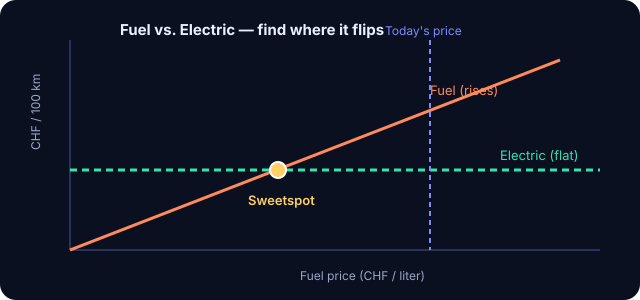

# PHEV Sweetspot Calculator

A small, beautiful web app for plug-in hybrid (PHEV) drivers: enter current fuel and
electricity prices plus your consumption, and instantly see whether you should **drive on
fuel or on electric power** — visualised as the crossing point ("sweetspot") of two cost graphs.



## What it does

- The **verdict is one sentence**: which is cheaper, what 100 km cost either way, how much
  that saves — and both tipping prices at once (*"only above CHF 0.56/kWh — or below
  CHF 1.00/l — would filling up be cheaper"*). The assumptions behind the numbers follow as
  a small footnote, so nothing has to be decoded.
- **Profiles as chips, in one line each** — `Trip: Summer · Winter · With trailer` and
  `Charging: Home · Weekend · Public fast charger`. Every option is visible without opening
  anything, switching is a single click, and the current fuel price stays as it is.
- **Where the electricity price tips** — a collapsed one-axis view of the same answer: the
  electricity price scale, green while charging is cheaper, amber once fuel is, a white-edged
  marker for the price you pay and a yellow mark at the tipping price. It answers the
  question asked at the charger without reading any axes; the 2D map below stays the main
  picture. Whether it is left open is remembered.
- The **chart** is one fixed 2D map: fuel price on x (CHF/l), electricity price on y
  (CHF/kWh). The diagonal **tipping line** (`break_even_*` in the API) is where both cost the
  same; below it charging wins, above it fuel wins. A **current-position dot** marks your
  prices and a **sweetspot marker** sits on the line at the tipping price, so you see at a
  glance which side you're on and how far away the sweetspot is. It sits under the answer as
  its evidence — no legend, everything is labelled in the picture itself.
- **One editing place per value, one saving rule.** All numbers are edited in
  *Calculation values*; nothing is stored until you press Save. Anyone may change them for a
  what-if — unsaved values are flagged **"Preview — not saved"** with one click back to the
  saved version. The owner gets a Save button in the same bar that names exactly what it
  will write (*"Save for Winter, Home, fuel price"*).
- **Current fuel price** — a single global value (with quick −/+ buttons) shown at the top.
  Fuel price changes often and is the same at the pump for every scenario, so you set it
  once and it applies everywhere. Below the field, *"Set on 16 Jul 2026 (30 days ago)"*
  says how fresh the stored price is — after two weeks the line turns amber.
- **Scenarios** (Winter, Summer, With trailer, …) — named presets, each holding a consumption
  profile (l/100km and kWh/100km). Names are bilingual (German + English) and shown in the
  active UI language.
- **Charging locations** — a list of places, each with its own CHF/kWh price (changes rarely).
  Seeded with Home (0.31), Weekend (0.40) and Public fast charger (0.90).
- **Manage lists** — a collapsed section (owner only) for adding, renaming and deleting
  scenarios and locations. Names only; the numbers live in *Calculation values*. New entries
  need a name in the current language, the other one can follow later.
- **English / German** — switch the whole UI language with the EN/DE toggle (top right).
  Your choice is remembered.
- Everything is stored in a local **SQLite** database and survives restarts. Databases
  created by older versions are migrated automatically on startup.
- **Works offline** — Chart.js, the annotation plugin and the Inter font are self-hosted
  under `app/static/vendor/` and `app/static/fonts/` (no CDN / internet needed).

## The math

```
fuel cost / 100 km     = fuel_consumption (l/100km)  × fuel_price (CHF/l)
electric cost / 100 km = power_consumption (kWh/100km) × kwh_price (CHF/kWh)
break-even fuel price  = (power_consumption × kwh_price) / fuel_consumption
break-even kWh price   = (fuel_consumption × fuel_price) / power_consumption
```

Example: `6.5 × 1.80 = CHF 11.70` (fuel) vs. `21 × 0.31 = CHF 6.51` (electric) →
electric wins; break-even fuel price ≈ `CHF 1.00 / l`. The mirror question — *at fuel
CHF 1.80/l, how expensive can charging get before fuel wins?* — gives the **break-even
kWh price** ≈ `CHF 0.56 / kWh`.

## Setup

```bash
python3 -m venv .venv
.venv/bin/pip install -r requirements-dev.txt   # runtime + test deps (app only: requirements.txt)
```

## Run

```bash
.venv/bin/python -m uvicorn app.main:app --reload --host 0.0.0.0 --port 8000 --log-config uvicorn_log_config.json
```

Then open http://localhost:8000

## Access control (read-only for everyone, owner edits)

Everyone can **view and play with** the values (live what-if), but only the **owner** can
**persist** changes. All `GET` endpoints are public; every `POST/PUT/DELETE` requires an
owner session. Guests see a read-only UI with a 🔒 *Edit* button; logging in unlocks editing.

Set your own password (the hash is never stored in code):

```bash
python -m app.auth          # prompts for a password, prints the values below
```

Then provide these as environment variables (e.g. in Docker / the reverse proxy):

| Variable | Purpose |
| --- | --- |
| `OWNER_PASSWORD_HASH` | PBKDF2 hash of your edit password (from `python -m app.auth`). |
| `SWEETSPOT_SECRET` | Random secret for signing the session cookie (`python -m app.auth` prints one). |
| `COOKIE_SECURE` | Set to `1` when served over HTTPS so the session cookie is `Secure`. |

If `OWNER_PASSWORD_HASH` is unset, editing is **disabled** (read-only calculator) — the app
fails safe. For local development set `ALLOW_DEFAULT_PASSWORD=1` to enable the default dev
password (`sweetspot`); a warning is logged. Login attempts are rate-limited per IP
(brute-force protection).

## Test

```bash
.venv/bin/python -m pytest -q
```

## Project layout

```
app/
  main.py        FastAPI app + REST API
  auth.py        owner login, password hashing, session cookies (also a CLI: python -m app.auth)
  calc.py        pure cost math (unit-tested)
  models.py      SQLAlchemy models (Scenario, ChargingLocation, Settings)
  schemas.py     Pydantic schemas
  crud.py        DB access + first-run seeding
  database.py    engine / session / Base
  templates/index.html
  static/css/styles.css
  static/js/app.js
  static/vendor/ self-hosted Chart.js + annotation plugin (offline)
  static/fonts/  self-hosted Inter font (offline)
tests/test_calc.py
Dockerfile               container image
docker-compose.yml       runs the GHCR image (production)
docker-compose.build.yml  offline override: build on the host instead of pulling
ship.sh                  trigger a deploy on the server over SSH
bundle.sh                offline fallback: source tarball
DEPLOY.md                deployment guide (NPM, HTTPS, GHCR, rollback)
.github/workflows/deploy.yml   CI: build image on push to main, push to GHCR
```

## API

All `GET` endpoints are public; every `POST/PUT/DELETE` (except login/logout) requires an
owner session — see [Access control](#access-control-read-only-for-everyone-owner-edits).

| Method | Path | Purpose | Owner only |
| --- | --- | --- | --- |
| GET | `/api/me` | current auth state (logged in?) | — |
| POST | `/api/login` | log in as owner (rate-limited per IP) | — |
| POST | `/api/logout` | clear the owner session | — |
| GET/POST | `/api/scenarios` | list / create scenarios | POST |
| PUT/DELETE | `/api/scenarios/{id}` | update / delete | yes |
| GET/POST | `/api/locations` | list / create charging locations | POST |
| PUT/DELETE | `/api/locations/{id}` | update / delete | yes |
| GET/PUT | `/api/settings` | read / update the global fuel price | PUT |
| GET | `/api/calculate?scenario_id=&location_id=` | compute the comparison | — |

## Deployment

CI builds the image and the server pulls it — no manual tarball, no build on the host.
Full guide (Nginx Proxy Manager, HTTPS, GHCR login, rollback): **[`DEPLOY.md`](DEPLOY.md)**.

```
git push  ──▶  GitHub Actions builds & pushes  ──▶  ghcr.io/rjo3510/phev-sweetspot
                                                          │
                                    ./ship.sh  ──ssh──▶  server: docker compose pull && up -d
```

```bash
git push                             # GitHub Actions builds & pushes the image to GHCR
PHEV_SERVER=user@phev-host ./ship.sh # pull the new image on the server and restart
```

`./ship.sh` runs from any machine that can SSH to the server (the dev VM can't reach it).
The app listens on container port `8000`, is published on the host as `http://<host>:8082`
(`APP_PORT`), and is also reachable by container name (`phev-sweetspot`) on the proxy network.
